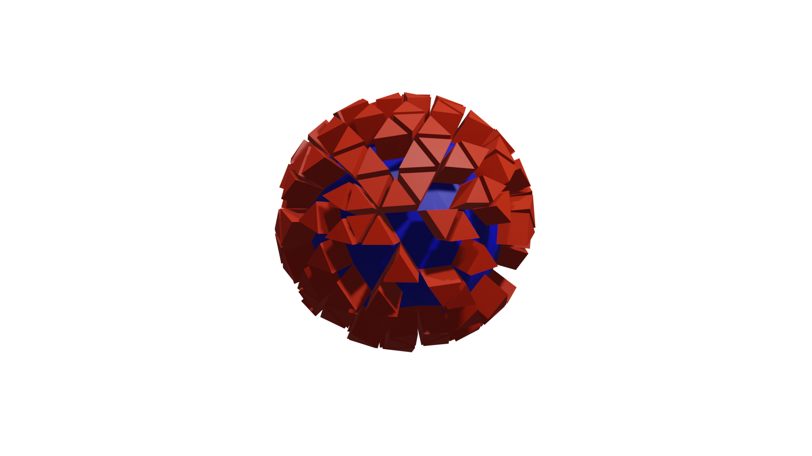

# 快速入门

```{admonition} 先备条件

在使用 **`geonodes`** 前，你必须先了解：
- `Blender` 几何节点
- `Python` 语言
- 如何在 `blender` 中执行 `Python` 脚本
```

安装与你的 `Blender` 兼容的 **geonodes** 版本。

```{important}
您可以问自己实现特定节点的方法的名称是什么，以及节点套接字的名称是什么。只需使用名称的snake_case版本。有关详细信息，请参阅命名约定。您也可以参考API文档。
```

## 导入模块

我们假设所有脚本都以以下导入指令开始：

``` python
import geonodes as gn
``` 

## 第一个节点树

执行以下代码段:

``` python
import geonodes as gn

with gn.Tree("空树") as tree:

   # `og`和`ig`是`output_geometry`和`input_geometry`的缩写

   tree.og = tree.ig
```

这段代码只是创建了将输入几何图形连接到输出几何图形的树。

添加一个几何节点修改器到你的对象中，作为参数，在列表中选择名为**空树**的节点树。

但一切都不像预期的那样发生!

## 第一个节点操作

让我们用输入几何面，来构造一些更有趣的东西。我们将细分它并使其平滑:

``` python
import geonodes as gn

with gn.Tree("Shading smooth") as tree:

  geo = gn.Mesh(tree.ig)      # 获取几何输入（a mesh)
                              # 初始化为一个`Mesh`对象，然后就能使用`Mesh`的方法
  
  geo.subdivide()             # 节点 'Subdivide Mesh'
  geo.set_shade_smooth(True)  # 节点 'Set Shade Smooth'
  
  tree.og = geo               # tree.output_geometry = geo 的缩写
``` 
(域的使用)=
## 域的使用

```{note}
对几何图形的操作通常是对域属性的操作。通过明确操作哪个域，可以编写更清晰的代码。例如，给网格着色实际上是设置网格面属性。
```

更简明的写法:

``` python
geo.faces.shade_smooth = True
``` 

这一次，平滑的阴影被视为面(域)的属性。和其他属性一样，`shade_smooth`可以被设置，也可以被获取。 

在下面的代码中，变量`smoothed_faces`包含了所有网格面的`True`或`False`值，这取决于它们是否被平滑。

``` python
smoothed_faces = geo.faces.shade_smooth
```

## 用户输入（Input）

在几何节点中，用户参数被实现为树输入套接字。这些输入可以用所有**geonodes**类中可用的类构造函数`Input`来创建，例如:

``` python
import geonodes as gn

with gn.Tree("Geometry Nodes") as tree:
   object = gn.Object.Input(None, "Other geometry")
   count  = gn.Integer.Input(10, "Count", min_value=2)
   factor = gn.Float.Input(0.5, "Factor", min_value=0, max_value=1, description="Use this value to control the modifier effect")
   mat    = gn.Material.Input(None, "A material")
```

输入构造函数以套接字名作为参数。对于诸如`Integer`或`Float`之类的值，它将默认值作为第一个参数。它还可以接受`min_value`, `max_value`和描述参数，以便更好地控制。

## 节点树的输出（Output）

如上所示，生成的几何图形可以输出:

``` python
tree.output_geometry = geo # 也可以使用别名缩写：tree.og
```

要输出其他值，使用所有类中可用的`to_output`方法:

``` python
v = mesh.verts.position   # Position of vertices
v.to_output("Location")   # Location output sockets is created. Its type is Vector 
```

## 更进一步的例子

让我们创建一个`icosphere`，添加两种材质，并在表面上随机设置材质。一旦完成，将挤压面与一个特定的材质。

再次之前，我们需要先知道:

- [如何创建几何体](#创建几何体)
- [如何添加材质](#添加材质)
- [在域的选集上修改属性](#域的选集)



(创建几何体)=
### 创建几何体

通过调用几何类的构造函数来创建几何图形。这些构造函数对应于Blender中“添加节点”菜单中的“基础网格”和“基础曲线”。 

构造函数的名称构建为其节点名称的CamelCase版本。

``` python
icosphere = gn.Mesh.IcoSphere()
```

这将创建默认的`icosphere`。我们可能需要一些定制。查看节点引用[Mesh.IcoSphere](api/Mesh.md#IcoSphere)。

我们看到有两个参数:`radius`和`subdivisions`。它们被实现为构造函数的参数。

正如在[命名约定](命名约定.md)中解释的那样，`geonode`使用snake_case版本的节点套接字和节点参数名称:

``` python
icosphere = gn.Mesh.IcoSphere(radius=1, subdivisions=3)
```

你可能想要对这些参数给予更多的控制:

``` python
radius    = gn.Float.Input(1, "Radius", min_value=0.01, max_value=10,\
            description="A reasonable radius for the sphere")
subs      = gn.Integer.Input(3, description="No limits: I trust you")
icosphere = gn.Mesh.IcoSphere(radius=radius, subdivisions=subs)
```

我们现在有了一个`icosphere`，它可以通过向用户公开参数来创建。

(添加材质)=
### 添加材质

材质是面的特性。语法类似于`mesh.faces.material = ...`

材质用它的名称来实例化。让我们假设我们有两个名为“红色”和“蓝色”的现有材质。

为了将材质分配给我们的`icosphere`，我们写道:

``` python
icosphere.faces.material = "Red"
icosphere.faces.material = "Blue"
```

```{warning}
如果材质不存在，脚本就会崩溃。最好要求用户提供自己的材质:
```

```python
mat_base = gn.Material.Input(None, "Base").    # Supposed to be Blue
mat_sel  = gn.Material.Input(None, "Selected") # Supposed to be Red

icosphere.faces.material = mat_base
icosphere.faces.material = mat_sel
```
(域的选集)=
### 域的选集

产生的`icosphere`是红色的，因为第二个材质被分配给所有的面孔，覆盖了前一个分配。但我们想要的是随机选择不同颜色的面。可以通过使用选择参数“调用”它们来选择这些面。

``` python
icosphere.faces[ random_selection ].material = mat_sel
```

可以使用类[Boolean](api/Boolean.md#Random)的`Random`构造函数生成随机选择:

``` python
icosphere.faces[ gn.Boolean.Random(probability=0.5) ].material = mat_sel
```

这一次，红色材质将只覆盖50%的蓝色面。

另一种达到这个结果的方法是使用材质索引:

``` python
icosphere.faces.material = mat_base # --> Material index 1
icosphere.faces.material = mat_sel  # --> Material index 2
```
添加了两种材质，所有面的材质索引设置为2，让我们把它们的一半改回1：

``` python
icosphere.faces[ gn.Boolean.Random(probability=.5) ].material_index = 1
```

### 挤出

`Extrude Mesh`节点接受一个域参数来定义必须挤出的内容。对于`geonode`，有3种可能性:

``` python
mesh.faces.extrude()
mesh.edges.extrude()
mesh.verts.extrude()
```

我们想要挤出面，但只是红色的面:

``` python
faces = icosphere.faces
faces[faces.material_index.equal(2)].extrude()
```
```{note}
使用`material_index.equal(2)`而不是`material_index == 2`。后一个表达式将给出一个 python `bool`结果，而不是预期的`geonodes`布尔值。
```{note}
后一种写法作为一种新特性在最新版中已经添加。2023-3-18
```

或者，如果你对材质索引没有信心，你可以使用`material_selection`方法:

``` python
faces[faces.material_selection(mat_sel)].extrude()
```

挤压本身可通过挤压参数进行控制:

``` python
faces[faces.material_index.equal(1)].extrude(offset_scale=0.3)
```

### 完整代码

```{admonition} 注意
:class: seealso
头3行和尾7行用到了另外一个库，涉及对blender场景对象的操作，读者可以忽略。
```

``` python
from imare import *
init_modules(__file__, "imare", "geonodes")
flush_data()

import geonodes as gn

mat_a = bpy.data.materials.new("a")
mat_a.diffuse_color = (0, 0, 1, 1)

mat_b = bpy.data.materials.new("b")
mat_b.diffuse_color = (1, 0, 0, 1)

with gn.Tree("Geometry Nodes", reroute=False) as tree:

    # Good practice: let's start with the tree inputs

    radius = gn.Float.Input(1, "Radius", min_value=0.01, max_value=10,\
             description="A reasonable radius for the sphere")
    subs   = gn.Integer.Input(3, description="No limits: I trust you")

    mat_base = gn.Material.Input("a", "Base")
    mat_sel  = gn.Material.Input("b", "Selected")

    # The icosphere

    icosphere = gn.Mesh.IcoSphere(radius=radius, subdivisions=subs)

    # The materials

    faces = icosphere.faces

    faces.material = mat_base
    faces[gn.Boolean.Random(probability=.5)].material = mat_sel

    # Extrude the select faces

    faces[faces.material_index == 2].extrude(offset_scale=0.3)

    tree.og = icosphere


Tree({
    O.cube @ "Cube": {
        Mod.geometry_nodes: {
            "node_group": "Geometry Nodes",
        },
    },
}).load()

```


