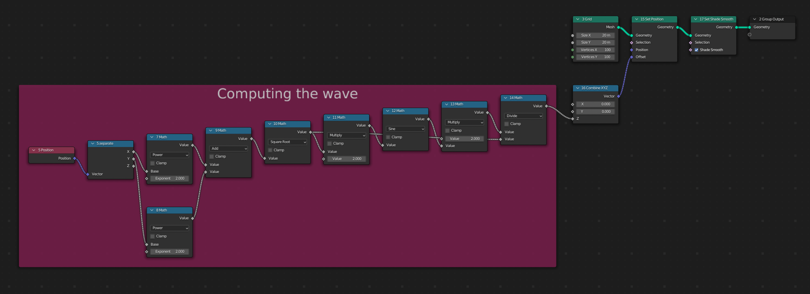
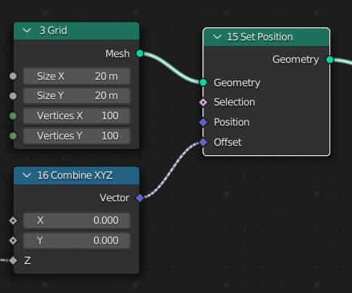

# 水波

# Demo script

> Let's review this demo script in detail. Afterwards, you should be able to script your own tree.

The script creates a surface from a grid by computing
$z = sin(d)/d$ where $d=sqrt(x^2 + y^2)$ is the distance of the vertex to the center.

```python
import geonodes as gn

with gn.Tree("Geometry Nodes") as tree:

    # Let's document our parameters
    count  = 100  # Grid resolution
    size   = 20   # Size
    omega  = 2.   # Period
    height = 2.   # Height of the surface
    
    # The base (x, y) grid
    grid = gn.Mesh.Grid(vertices_x=count, vertices_y=count, size_x=size, size_y=size)
    
    # We compute z
    with tree.layout("Computing the wave", color="dark_rose"):
        distance = gn.sqrt(grid.verts.position.x**2 + grid.verts.position.y**2)
        z = height * gn.sin(distance*omega)/distance
        
    # Let's change the z coordinate of our vertices
    grid.verts.position += (0, 0, z)
    
    # We are done: plugging the deformed grid as the modified geometry
    tree.output_geometry = grid.set_shade_smooth()
                   
```

The generated nodes and the result of the Geometry nodes modifier is given below:


## Description

### Import

```python
import geonodes as gn
```

Be sure to have properly installed the **geonodes** module as described in the [Installation section](../README.md#installation).

`gn` is the proposed alias to use as **geonodes** naming space.

### Tree creation

A Tree instance can be created with
  
```python
tree = Tree(tree_name)
...
tree.close()
```

But it is recommanded to use `with` syntax to ensure that the tree will be properly closed. The closing performs final mandatory treatments.

```python
with gn.Tree("Geometry Nodes") as tree:
    ...
```

The `tree_name` is the name of a geometry nodes modifier. If it doesn't exist, it will be created.

> **Warning** when calling `tree(tree_name)`, ***all the nodes and links are erased***. Be sure not to open a tree with an existing valuable tree you don't want to loose.

The tree can be created with the argument `group=True` when the generated tree is not to be used as a modifier:

``` python

with gn.Tree("Custom function", group=True):
   ...

```

With the default option `group=False`, first sockets (input and output) are `Geometry`.

Within the scope of a Tree creation / closure, all nodes are created within this tree without the need to make explicit reference to this tree.

In the following example, the `grid` mesh is created in `tree` without making any explicit reference to it. 

```python
with gn.Tree("Geometry Nodes') as tree:

    grid = gn.Mesh.Grid(vertices_x=count, vertices_y=count, size_x=size, size_y=size)
```

Fore more details, see [class Tree reference](api/Tree.md)

### Variables

You can use standard Python variables:

```python
    count  = 100  # Grid resolution
    size   = 20   # Size
    omega  = 2.   # Period
    height = 2.   # Height of the surface
```

The variables can be used for standard python computing:

```python
# We need an angle of 30 degrees
angle = math.pi / 6
```

The variables can also be used as default values of node sockets:

```python
# Let's create an UV sphere of radius 0.5
r = 0.5
sphere = gn.Mesh.UVSphere(radius=r)
```

In the created node, the input socket `radius` is initialized with `0.5`:


### Geonodes types

In this example, the variables are initialized in the script. They are pure Python variables. To change them, one needs to modify the script and to rerun it.

When creating a tree, we often need to change settings to see the effect on the geometry. This can be achieved by initializing a **geonodes** type rather than a python type.

In the following script, we slightly modify our code by initializing `size` as a **geonodes** type. It is not anymore a Python `float` but a **geonodes** `Float` i.e. the output socket of a Geometry Node (in that case, the output socket of the input node 'Value'):

```python
    count  = 100
    size   = gn.Float(20.)
    
    grid = gn.Mesh.Grid(vertices_x=count, vertices_y=count, size_x=size, size_y=size)
````

The resulting tree is the following. The two `Vertices` input sockets are initialized with the same value. The two `Size` sockets are linked to the output socket of a 'Value' node. One can change the value of the node to see the result on the output geometry.


> Note: remember that the nodes are deleted a each run of the script.
> Hence, if you change the value in a node, the change will be lost next time you will run the script.
> To avoid that, either your put the value you want in the script or your read the next section.

### Group inputs

Rather that creating an input Node to initialize your data, you can use a group socket, i.e. a **Group input socket**. All data socket classes expose the constructor method `Input`.

Let's modify our script. This time, we initialize `count` as being a Group input socket.

> Note: an **input** socket of the modifier is an **output socket** of the node 'Group Input'.

```python
    count  = gn.Integer.Input(100, "Grid resolution")
    size   = gn.Float(20.)
    
    grid = gn.Mesh.Grid(vertices_x=count, vertices_y=count, size_x=size, size_y=size)
````
In the resulting tree, the node 'Grid' is now fed by one node and a user parameter named 'Grid resolution':


### Geometry creation

In our demo, the initial grid is created with the following line:

```python
    grid = gn.Mesh.Grid(vertices_x=count, vertices_y=count, size_x=size, size_y=size)
```

Geometry creation is done through the nodes located in the Blender add menus **Mesh Primitives** and **Curve Primitives**.

In **geonodes**, these nodes are implemented as **constructors** (_class_ or _static_ methods) of [Mesh](sockets/Mesh.md) of [Curve](sockets/Curve.md) classes.

### Layouts

Layouts are ways to make the trees clearer. Creating a layout is done in the context of `with` syntax: any new node created in the scope of a `with` is included in the layout:

```python
    with tree.layout("Computing the wave", color="dark_rose"):
    
        # From now on, nodes will be created in a dark pink layout
        
        distance = gn.sqrt(grid.position.x**2 + grid.position.y**2)
        z = height * gn.sin(distance*omega)/distance
        
   # New nodes are created out of the previous layout
```



Note that layouts can be imbricated.

### Math

**geonodes** provides math functions such as `sin`, `arccos` or `color_subtract` based on the nodes 'Math', 'Vector Math' and 'Boolean Math'... Here after are examples of valid operations:

```python
a = gn.Float(10)         # The node "Value"
a += 3                   # Node "Math" between previous node and default value 3
b = gn.sin(a)            # Math operations are implemented as functions
v = gn.Vector((1, 2, 3)) # Node "Combine XYZ"
w = v - (2, 3, a)        # Vector math between the previous vector and a "Combine XYZ" node
```

#### Boolean math

Python bool operators `and`, `or` and `not` are reserved keywords. **geonodes** functions are respectively named `b_and`, `b_or` and `b_not`:

```python
yes = gn.Boolean(True)
no = yes.b_not()            # Don't use no = not yes
perhaps = gn.b_or(yes, no)  # don't use perhaps = yes or no
```

The basic logical operations are implemented with math operator `+`, `*` and `-`:

```python
yes = gn.Boolean(True)
no = -yes          # Unary operator can be used as logical not
perhaps = yes + no # Operator + can be used as logical or
sure = yes * no    # Operator * can be used as logical and 
```

See [Nodes parameters and method names](nodes_and_sockets.md#nodes-parameters-and-method-names)

### Nodes methods

The call of a data socket method creates a Geometry node which performs the expected operation.

```python
    grid.set_position(offset=(0, 0, z))
```

The node 'Set Position' has 4 input sockets (Geometry, Selection, Position, Offset). In this example, the node is created with the following links:
- Geometry : linked with the output socket grid
- Selection : no link
- Position : no link
- Offset : linked ot the output socket of a node 'Combine XYZ'

This is illustrated here below:



### Domains

Geometry domains are implemented as properties of the geometry classes:

- Mesh:
  - verts
  - faces
  - edges
  - corners
- Curve
  - points
  - splines
- Points (cloud points)
  - points
- Instances
  - insts

Writing `grid.set_position()` means that you change the position of the grid.
**But this is not what is done!**. In fact, you change the position of the **vertices** of the grid.

This is why, it is far more better to write:

```python
grid.verts.position += (0, 0, z)
```

#### Domains selection

Operations on domains use a **Selection** input socket. This feature is implemented in two different ways:

- As argument of the domain property:

  ```python
  # Only one vertex on two will be changed

  grid.verts((grid.verts.index % 2).equal(0)).position += (0, 0, z)
  ```

- Using array index:

  ```python
  # Only the vertices between 5000 and 8000 will be changed
  grid.verts[5000:8000].position += (0, 0, z)
  ```
  
Both methods can be combined:

  ```python
  grid.verts((grid.verts.index % 2).equal(0))[5000:8000].position += (0, 0, z)
  ```


### Output geometry

To define a geometry as the result of the modifier, simply set the `output_geometry` property of the tree.

```python
    tree.output_geometry = grid.set_shade_smooth()

    # Or you can use the 'shortcut' og
    tree.og = grid.set_shade_smooth()
    
```

## Further reading

``` python
from imare import *
init_modules(__file__, "imare", "geonodes")
flush_data()

import geonodes as gn
from geonodes.nodes import nodes
import numpy as np
from math import pi, tau


with gn.Tree("计算", group=True, shift=False) as tree:
    h = gn.Float.Input(2, "h", -3, 3)
    Ω = gn.Float.Input(2, "Ω")
    θ = gn.Float.Input(0, "θ")

    sep = nodes.Position().position.separate
    x, y = sep.x, sep.y

    d: gn.Float = gn.sqrt(x**2 + y**2)
    z: gn.Float = h * gn.sin(d * Ω - θ) / d

    z.to_output("z")


with gn.Tree("Geometry Nodes", reroute=False, shift=False) as tree:
    l = gn.Integer.Input(20, "大小")
    n = gn.Integer.Input(200, "采样")
    h = gn.Float.Input(2, "高度", -3, 3)
    Ω = gn.Float.Input(2, "波长")
    θ = gn.Float.Input(0, "偏移")

    slice = gn.Boolean.Input(True, "切片")

    # The base (x, y) grid
    grid = gn.Mesh.Grid(l, l, n, n)

    t = nodes.SceneTime().frame
    # θ = gn.sin(t / 20) * tau
    z = getattr(gn.Trees(), "计算")(h=h, Ω=Ω, θ=gn.sin(t / 60) * tau).z

    index = nodes.Index().index
    # if slice is Not (e.g. -slice), then switch the selection to None
    selection = index.modulo(2).equal(0).switch(-slice, None)

    # grid.verts[gn.Integer(20000):].set_position(offset=(0, 0, z))
    # grid.verts[selection].set_position(offset=(0, 0, z))
    grid.verts[gn.Integer(20000):][selection].set_position(offset=(0, 0, z))

    tree.og = grid.set_shade_smooth()

Tree({
    O.cube @ "Cube": {
        Mod.geometry_nodes: {
            "node_group": "Geometry Nodes",
            # "高度": [(1, 0), (30, 2), (60, 0), (90, -2), (120, 0)],
            # "偏移": [(1, 0), (30, pi / 2), (60, 0), (90, -pi / 2), (120, 0)],
        },
    },
}).load()
bpy.context.scene.frame_end = 18000
```
